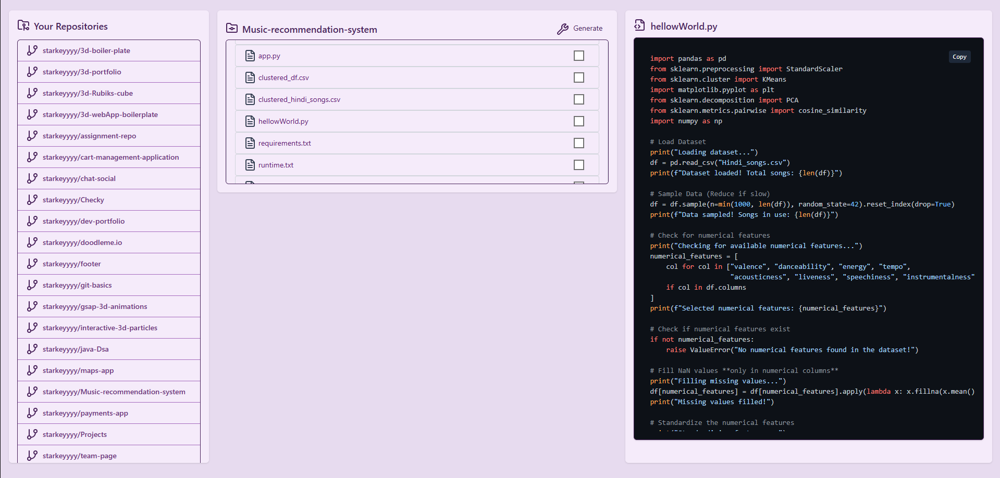
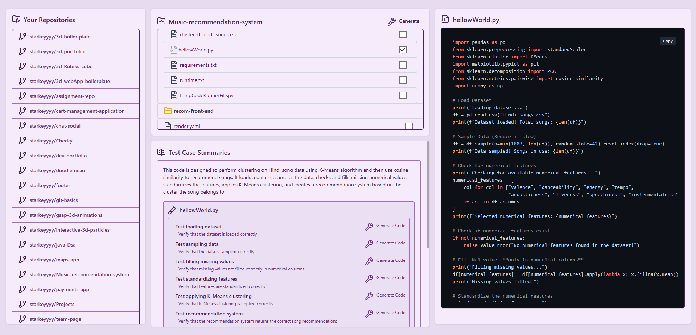
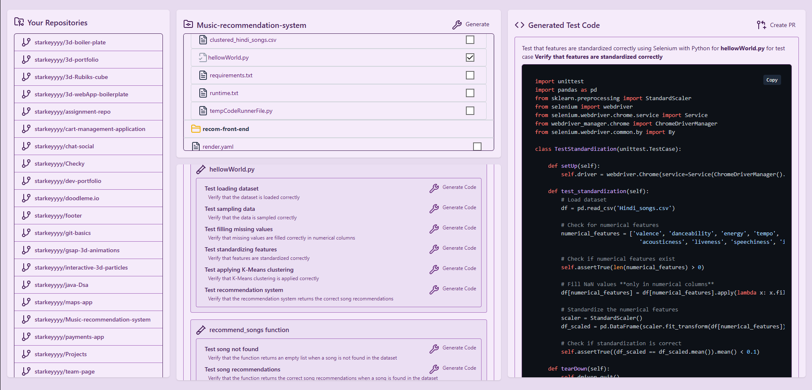

# 🧪 GitHub Test Case Generator

A full-stack application that connects with your GitHub account, lets you browse your repositories in a clean file-tree UI, and uses **AI (LLaMA 3.1 via Hugging Face)** to generate **test case summaries** and **test code** for your selected files.

It even allows you to create a **pull request** with the generated test code on a new branch — directly from the app!

---

## 🚀 Features

- 🔐 GitHub OAuth login
- 📁 Browse all your GitHub repositories
- 🧾 Clean file tree structure for navigating repository files
- 🤖 Generate test case summaries and test code using:
  - `meta-llama/Llama-3.1-8B-Instruct:novita` (via Hugging Face Inference API)
- 📝 Built-in Monaco Editor to preview and edit generated test code
- 🔄 Automatically create a new branch and open a Pull Request with the generated files

---

## 🧰 Tech Stack

| Layer         | Technology/Service                                 |
|---------------|----------------------------------------------------|
| Frontend      | React, Tailwind CSS, Monaco Editor                 |
| Backend       | Node.js (Express)                                  |
| Auth          | GitHub OAuth                                       |
| APIs          | GitHub REST API, Hugging Face Inference API        |
| AI Model      | `meta-llama/Llama-3.1-8B-Instruct:novita`           |
| Code Editor   | Monaco Editor                                      |

---

## 📸 Screenshots

> 
> 
> 

---

## 🛠️ Local Setup

### 1. Clone the Repository

```bash
git clone https://github.com/starkeyyyy/assignment-repo
cd assignment-repo
